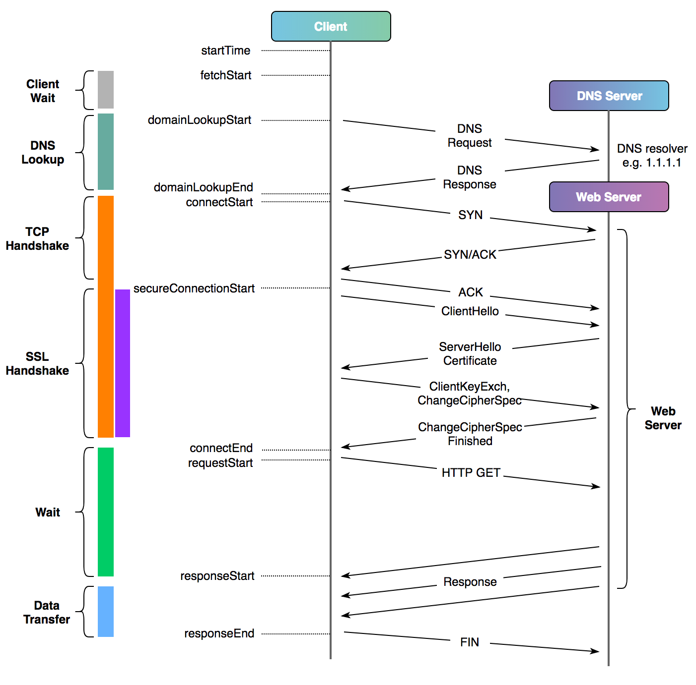

# Network Basics

- Explain OSI model.

- Explain client/server network transfers.

## Simple flow

From the [Cloudflare blog about timing web requests](https://blog.cloudflare.com/a-question-of-timing/), a typical network flow for a HTTP request between a client and server can be visualized as the following:

## Mutual TLS authentication

Mutual TLS authentication (mTLS) involves a flow where a client will verify the identity of the server via a valid certificate and the server will verify the identity of the client via the client certificate with the client public key to establish a trusted encrypted connection.

This adds an extra layer of security on top of traditional web based TLS traffic that only requires the server to provide a valid certificate.

## Testing

- Har to curl
  https://github.com/mattcg/har-to-curl

## For Deeper Dives

- Consider reading [TCP/IP Illustrated, Vol. 1: The Protocols](https://en.wikipedia.org/wiki/TCP/IP_Illustrated) and practice reading the various network protocols via [Wireshark](https://www.wireshark.org/).
