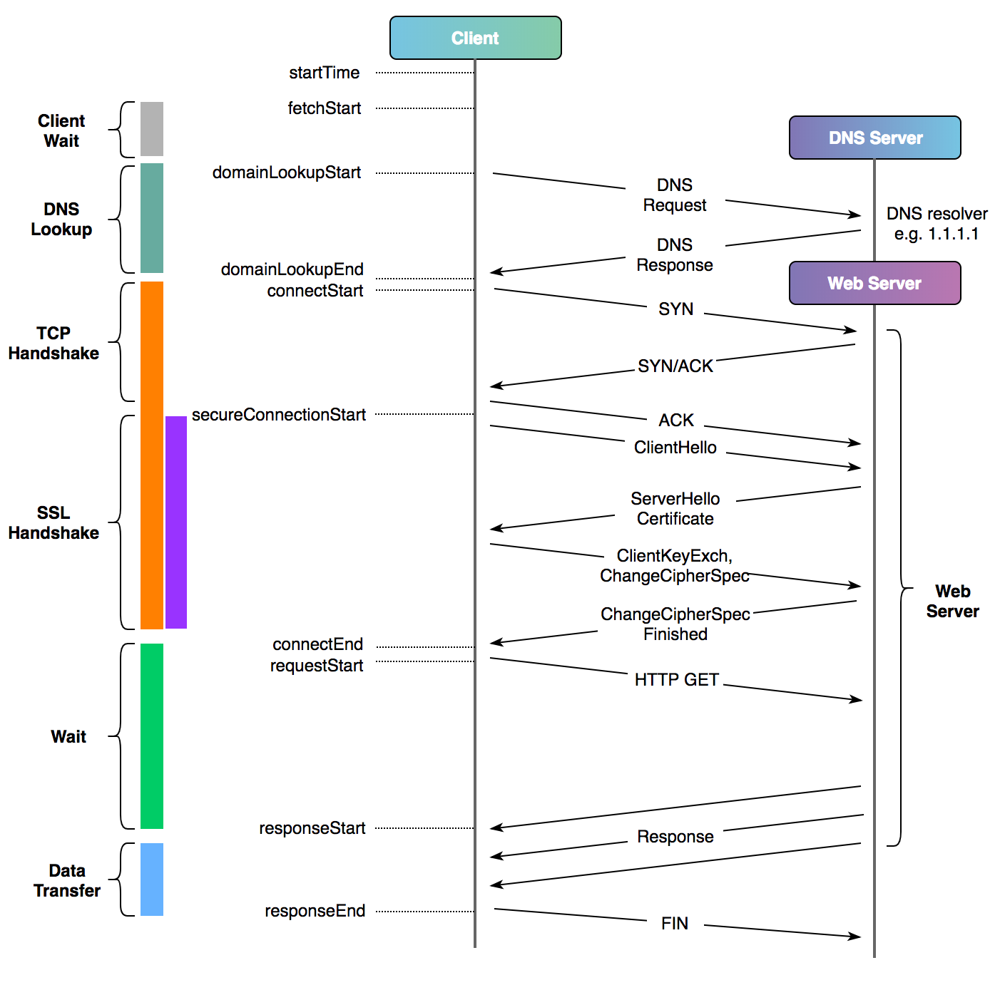
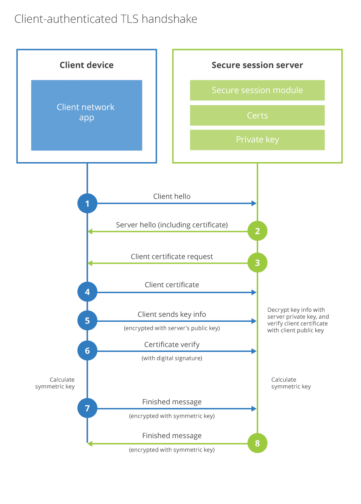

# Network Basics

Every request crosses several layers, and each layer fails in its own way.
The application protocol (HTTP, DNS, SSH) rides on a transport (TCP or UDP),
which rides on IP routing, which rides on a physical link. The OSI model
names seven layers, but for everyday debugging you can get by with four
questions: does the name resolve, can I reach the address, does the
transport connect, and does the protocol on top behave. The
[diagnosis](./diagnosis.md) chapter walks through those questions in order.

## How a connection is established

Before a single byte of HTTP moves, the client and server have already done
a lot of work. Each step below costs at least one round trip, can fail
independently, and has a tool in this guide that tests it in isolation.

**1. DNS lookup.** The client resolves the hostname to an IP address. If
this step is wrong, everything after it is wrong too, which is why
[dig](./tools/dig.md) comes first in any diagnosis.

**2. The TCP three-way handshake.** TCP gives both sides a reliable byte
stream, and it opens with three packets:

```text
client  ── SYN ──────────────▶  server   "I want to talk. My sequence number starts here."
client  ◀────────── SYN-ACK ──  server   "Heard you. Mine starts here."
client  ── ACK ──────────────▶  server   "Confirmed."
```

After the third packet the connection is established and either side may
send data. The whole exchange costs one round trip. Failures here are easy
to read in a packet capture: a SYN that gets no reply at all usually means a
firewall dropped it silently, while an immediate RST reply means the port is
closed or a device refused the connection. [netcat](./tools/netcat.md)
tests exactly this layer and nothing above it, and
[tcpdump](./tools/tcpdump.md) lets you watch the three packets directly.

**3. The TLS handshake.** For HTTPS, the two sides next negotiate encryption
on top of the open TCP connection:

- The client sends a ClientHello: the protocol versions and cipher suites it
  supports, plus the server name it wants (SNI).
- The server picks the parameters, sends back its certificate chain, and
  proves it holds the matching private key.
- The client checks that chain against its local trust store. This is the
  step that fails when a corporate proxy intercepts TLS or a certificate
  expires.
- Both sides derive the session keys and exchange Finished messages.

TLS 1.3 fits this into one round trip; TLS 1.2 needs two.
[openssl](./tools/openssl.md) s_client performs this handshake and stops,
which makes it the right probe when TCP connects fine but HTTPS does not.

**4. The application talks.** Only now does the client send its HTTP request
and wait for a response. `curl -w` can time every phase above separately,
so you can see exactly which step ate the time.

A cold HTTPS request therefore pays for DNS, one round trip of TCP, and one
or two round trips of TLS before the first byte of content moves. That
arithmetic is why the [latency](./latency.md) chapter matters.

## Simple flow

From the [Cloudflare blog about timing web requests](https://blog.cloudflare.com/a-question-of-timing/), a typical network flow for a HTTP request between a client and server can be visualized as the following:

<p align="center">
  
</p>

## Mutual TLS authentication

In the handshake described above, only the server proves who it is. The
client stays anonymous as far as TLS is concerned, and identity is handled
later by the application (cookies, passwords, API keys).

Mutual TLS authentication (mTLS) moves the client's proof of identity into
the handshake itself. The flow extends step 3 above:

- After sending its own certificate, the server also sends a
  CertificateRequest, naming the certificate authorities it will accept
  client certificates from.
- The client sends its client certificate, then signs a hash of the
  handshake with its private key (the CertificateVerify message). The
  signature proves the client actually holds the key, not just a copy of
  the certificate.
- The server validates the client certificate against the CA it trusts for
  clients. Both sides have now authenticated each other before any
  application data is exchanged.

This adds an extra layer of security on top of traditional web based TLS
traffic that only requires the server to provide a valid certificate.

The failure mode is distinctive and worth memorizing: when a required client
certificate is missing, expired, or signed by the wrong CA, the connection
dies during the handshake, before any HTTP status code exists. If you see a
TLS alert (often `certificate required` or `handshake failure`) instead of a
403, think mTLS. To test, present a client certificate explicitly:

```bash
curl -sv https://auth.example.com --cert client.pem --key client-key.pem
```

```bash
openssl s_client -connect auth.example.com:443 -cert client.pem -key client-key.pem
```

<p align="center">
  
</p>

## Testing

- [har-to-curl](https://github.com/mattcg/har-to-curl) converts a HAR file
  (saved from the browser's network tab) into curl commands, so you can
  replay a browser request from the command line.

## For Deeper Dives

- Consider reading [TCP/IP Illustrated, Vol. 1: The Protocols](https://en.wikipedia.org/wiki/TCP/IP_Illustrated) and practice reading the various network protocols via [Wireshark](https://www.wireshark.org/).
